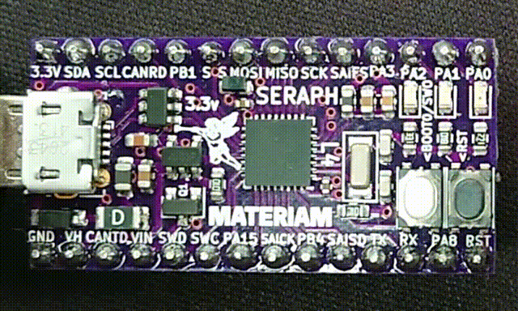

.. _SERAPH_board:

SERAPH L4
#########

Overview
********

The Seraph L4 is a breakout board for the little but mighty STM32L432KC ultra
low power Cortex M4 MCU. With its three bright RGB leds and user/BOOT0 button,
it's been especially designed for learning Zephyr and to be easily integrated in
your projects.

The STM32L432KC shines for its low power consumption, so we chose to power it up
with an STLQ020 ultra-low quiescent current LDO power supply that can source up
to 200 mA and consumes a mere 100μA at its peak 200mA load and only 300 nA at no
load!

USB ESD protection is provided through an USBLC6-2SC6 from ST. The Vin voltage
input is reverse polarity protected and there is also a 500 mA resettable fuse
to protect the USB/VIN power lines from overcurrents.

Last but not least, we've included big, high quality and comfortable buttons for
BOOT (white) and RESET (black) that go easy on your fingers and lets you put the
SERAPH board on DFU mode quickly without the need of jumpers or  connecting and
disconnecting the USB cable.

The STM32 built-in DFU bootloader lets the device be programmed without the use
of an external hardware programmer while saving valuable flash memory for user
applications. Not a single kb is wasted! Just press the user button (BOOT0)
while holding RESET in a fast and simple finger movement and the green led will
light indicating DFU mode.

- STM32L432KC MCU in UFQFPN32 package

- Flexible board power supply:

  - USB VBUS or external source(3.3V, 5V, up to 5.5V)
  - Power management access point

- Three LEDs: Red (LD0), Green (LD1), Blue (LD2)
- RESET push button
- USER/BOOT0 push button (User button through PH3)

Hardware
********

The STM32L432KC SoC provides:

- Ultra-low-power with FlexPowerControl (down to 28 nA Standby mode and 84
  µA/MHz run mode)
- Core: ARM 32-bit Cortex® -M4 CPU with FPU, frequency up to 80 MHz,
  100DMIPS/1.25DMIPS/MHz (Dhrystone 2.1)
- Clock Sources:

  - 32 kHz crystal oscillator for RTC (LSE)
  - Internal 16 MHz factory-trimmed RC (±1%)
  - Internal low-power 32 kHz RC (±5%)
  - Internal multispeed 100 kHz to 48 MHz oscillator, auto-trimmed by
    LSE (better than ±0.25 % accuracy)
  - 2 PLLs for system clock, USB, audio, ADC

- RTC with HW calendar, alarms and calibration
- Up to 3 capacitive sensing channels: support touchkey, linear and rotary touch sensors
- 11x timers:

  - 1x 16-bit advanced motor-control
  - 1x 32-bit and 2x 16-bit general purpose
  - 2x 16-bit basic
  - 2x low-power 16-bit timers (available in Stop mode)
  - 2x watchdogs
  - SysTick timer

- Up to 26 fast I/Os, most 5 V-tolerant
- Memories

  - Up to 256 KB single bank Flash, proprietary code readout protection
  - Up to 64 KB of SRAM including 16 KB with hardware parity check
  - Quad SPI memory interface

- Rich analog peripherals (independent supply)

  - 1x 12-bit ADC 5 MSPS, up to 16-bit with hardware oversampling, 200
    µA/MSPS
  - 2x 12-bit DAC, low-power sample and hold
  - 1x operational amplifiers with built-in PGA
  - 2x ultra-low-power comparators

- 13x communication interfaces

  - USB OTG 2.0 full-speed crystal less solution with LPM and BCD
  - 1x SAIs (serial audio interface)
  - 2x I2C FM+(1 Mbit/s), SMBus/PMBus
  - 3x USARTs (ISO 7816, LIN, IrDA, modem)
  - 2x SPIs (3x SPIs with the Quad SPI)
  - CAN (2.0B Active)
  - SWPMI single wire protocol master I/F
  - IRTIM (Infrared interface)

- 14-channel DMA controller
- True random number generator
- CRC calculation unit, 96-bit unique ID
- Development support: serial wire debug (SWD), JTAG, Embedded Trace Macrocell*

More information about STM32L432KC can be found here:

- `STM32L432KC on www.st.com`_
- `STM32L432 reference manual`_

Supported Features
==================

Seraph's Zephyr board configuration supports the following hardware features:

+-----------+------------+-------------------------------------+
| Interface | Controller | Driver/Component                    |
+===========+============+=====================================+
| NVIC      | on-chip    | nested vector interrupt controller  |
+-----------+------------+-------------------------------------+
| UART      | on-chip    | serial port-polling;                |
|           |            | serial port-interrupt               |
+-----------+------------+-------------------------------------+
| PINMUX    | on-chip    | pinmux                              |
+-----------+------------+-------------------------------------+
| GPIO      | on-chip    | gpio                                |
+-----------+------------+-------------------------------------+
| I2C       | on-chip    | i2c                                 |
+-----------+------------+-------------------------------------+
| SPI       | on-chip    | spi                                 |
+-----------+------------+-------------------------------------+
| PWM       | on-chip    | pwm                                 |
+-----------+------------+-------------------------------------+
| CAN       | on-chip    | can                                 |
+-----------+------------+-------------------------------------+

.. note:: CAN feature requires CAN transceiver

Other hardware features are not yet supported on this Zephyr port.

The default configuration can be found in the defconfig file:
``boards/arm/seraph/seraph_defconfig``

Connections and IOs
===================

Seraph Board has 6 GPIO controllers. These controllers are responsible for pin muxing,
input/output, pull-up, etc.

Available pins:
---------------

For mode details please refer to `STM32 Nucleo-32 board User Manual`_.

Default Zephyr Peripheral Mapping
=================================

Default DTS mappings for some hardware interfaces:

I2C
---

.. code-block:: dts

  &i2c1 {
  	pinctrl-0 = <&i2c1_scl_pa9 &i2c1_sda_pa10>;
  	clock-frequency = <I2C_BITRATE_FAST>;
  	status = "okay";
  };

SPI
---

  .. code-block:: dts

    &spi1 {
    	pinctrl-0 = <&spi1_nss_pb0 &spi1_sck_pa5 &spi1_miso_pa6 &spi1_mosi_pa7>;
    	status = "okay";
          cs-gpios = <&gpiob 0 GPIO_ACTIVE_LOW>;
    };

SPI with DMA
------------

.. code-block:: dts

  &spi1 {
  	pinctrl-0 = <&spi1_nss_pb0 &spi1_sck_pa5 &spi1_miso_pa6 &spi1_mosi_pa7>;
  	status = "okay";
  	dmas = <&dma1 3 1 0x20440 0x00
  	&dma1 2 1 0x20480 0x00>;
        dma-names = "tx", "rx";
        cs-gpios = <&gpiob 0 GPIO_ACTIVE_LOW>;
  };

  &dma1 {
    status = "okay";
  };

System Clock
------------

Driven by an external NX3215SA-32.768KHZ-EXS00A-MU00525 32.768 Khz crystal. By
default System clock is driven by PLL clock at 80MHz.

Serial Port
-----------

By default, the Zephyr console output is assigned to UART1 (TX: PB6 and RX: PB7).
Default settings are 115200 8N1.

.. code-block:: dts

  &usart1 {
  	pinctrl-0 = <&usart1_tx_pb6 &usart1_rx_pb7>;
  	current-speed = <115200>;
  	status = "okay";
  };

Programming and Debugging
*************************

Applications for the Seraph can be built using west:

.. code-block:: console

  $ west build

Flashing
========

The Seraph board can be flashed in three ways:

DFU-UTIL
--------

If you don't have a hardware programmer, you can flash the Seraph board using
just a USB cable and the embedded bootloader from ST. You will need to install
the dfu-util application (available in most Linux distros and on Hombrew in Mac
OS X).

Just press the USER/BOOT0 button (white) while the holding RESET (black) button,
then type:

.. code-block:: console

  $ west flash -r dfu-util

For programming using ST-LINK debug tool, select the openocd runner:

.. code-block:: console

  $ west flash -r openocd

For programming using Segger J-Link:

.. code-block:: console

  $ west flash -r jlink

Debugging
=========

You can debug an application in the usual way.  Here is an example for the
:ref:`hello_world` application.

.. zephyr-app-commands::
   :zephyr-app: samples/hello_world
   :board: nucleo_l432kc
   :maybe-skip-config:
   :goals: debug

.. _Nucleo L432KC website:
   http://www.st.com/en/evaluation-tools/nucleo-l432kc.html

.. _STM32 Nucleo-32 board User Manual:
   http://www.st.com/resource/en/user_manual/dm00231744.pdf

.. _STM32L432KC on www.st.com:
   http://www.st.com/en/microcontrollers/stm32l432kc.html

.. _STM32L432 reference manual:
   http://www.st.com/resource/en/reference_manual/dm00151940.pdf
